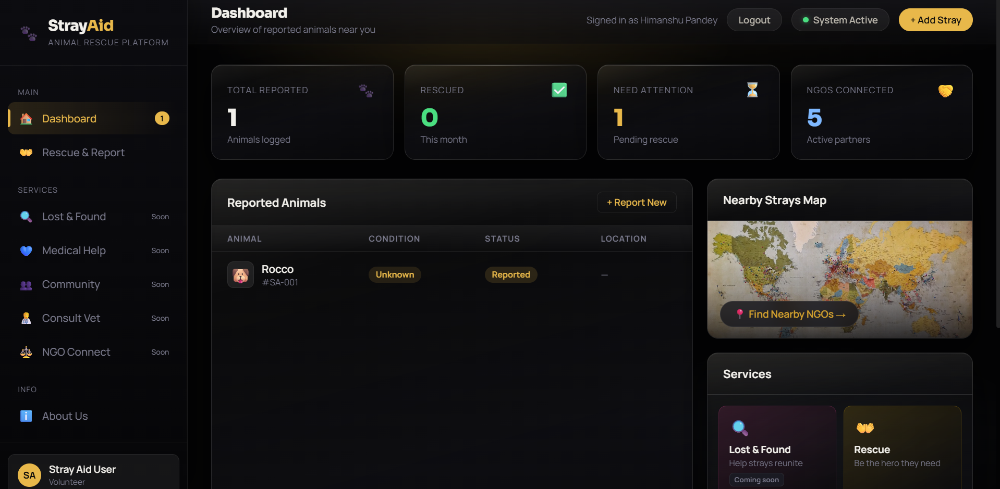
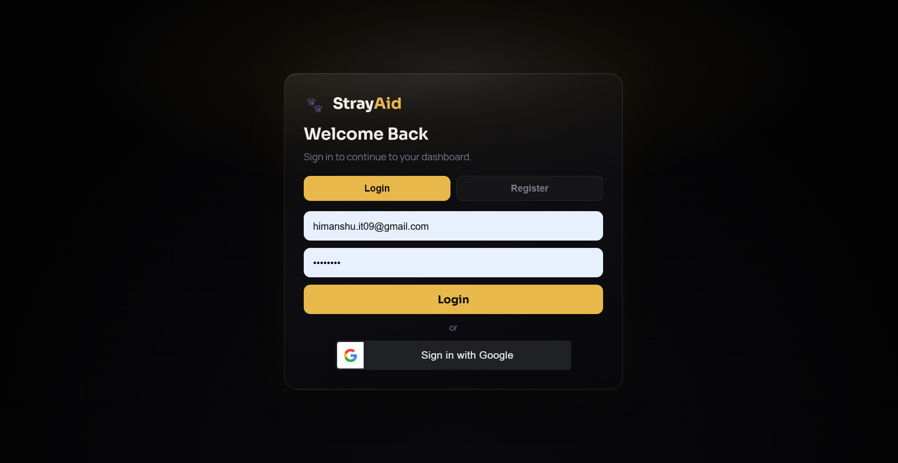
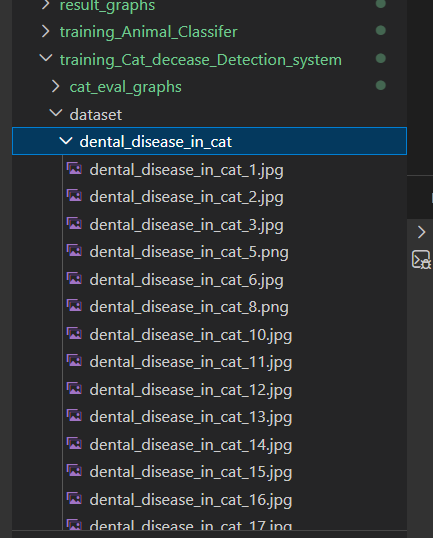
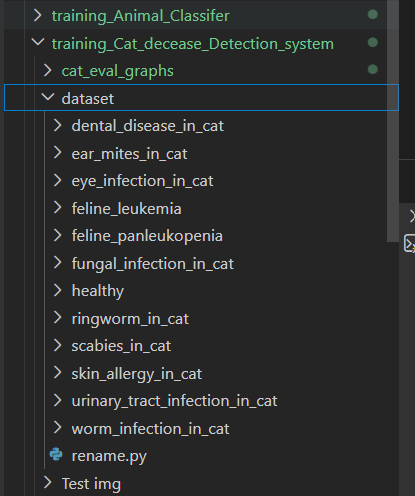
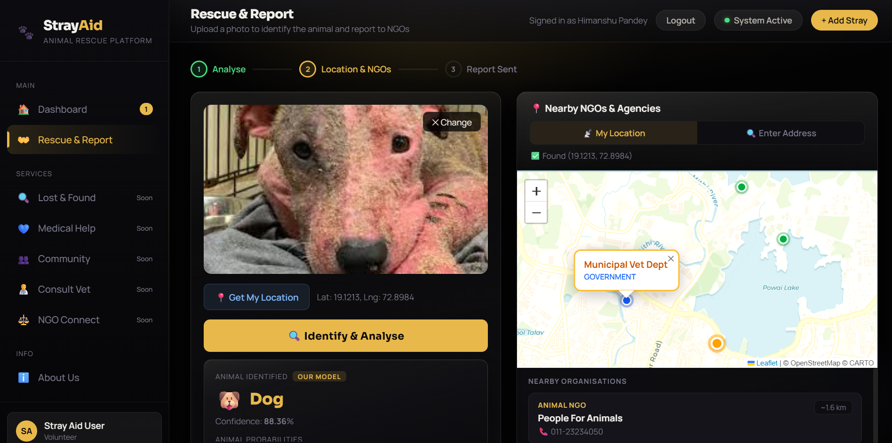
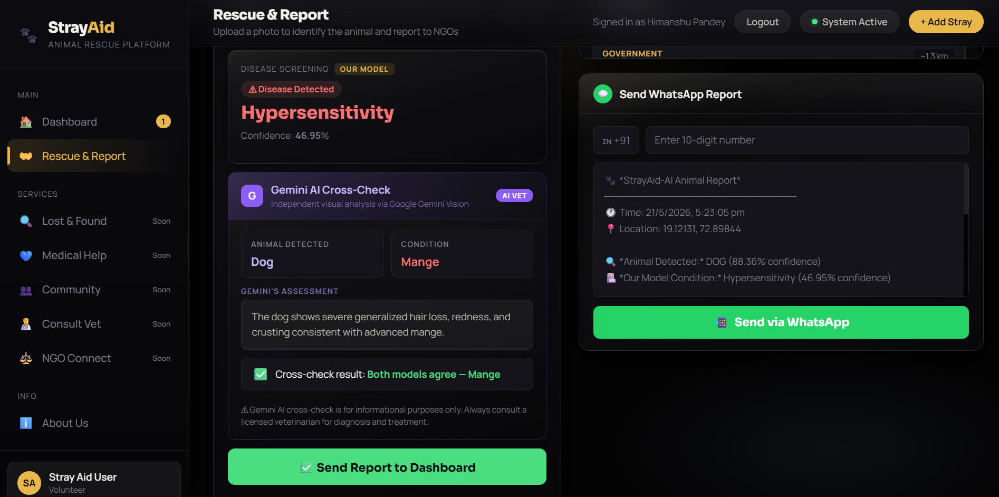

# 🐾 StrayAid — Agentic AI-Powered Stray Animal Rescue & Disease Detection Platform

<div align="center">



[](https://python.org)
[](https://flask.palletsprojects.com)
[](https://pytorch.org)
[](https://tensorflow.org)
[](https://ai.google.dev)
[](LICENSE)

**Upload a photo of a stray animal → AI identifies species + disease → Gemini cross-checks → WhatsApp report sent to nearest NGO**

[Features](#-features) • [Screenshots](#-screenshots) • [Tech Stack](#-tech-stack) • [Installation](#️-installation) • [How It Works](#-how-it-works) • [Results](#-results)

</div>

---

## 📌 Overview

StrayAid is a final year B.Tech project built to address the stray animal welfare crisis in India. Millions of stray cats, dogs, and cattle suffer from diseases without access to veterinary care. Most citizens who spot a suffering animal have no way to quickly assess the condition or reach the right rescue organisation.

StrayAid solves this by combining:
- **AI-powered species and disease detection** from a single photograph
- **Gemini Vision AI cross-check** that independently verifies the diagnosis
- **Real-time NGO map** showing nearby animal welfare organisations
- **One-tap WhatsApp reporting** with full case details and GPS coordinates
- **A live dashboard** tracking every reported animal and its rescue status

---

## ✨ Features

| Feature | Description |
|---|---|
| 🔐 **Authentication** | Secure login / register with Google OAuth support |
| 📊 **Rescue Dashboard** | Tracks all reported animals, conditions, and rescue status |
| 🔍 **Animal Classification** | Identifies cat, cow or dog using ResNet-18 (PyTorch) |
| 🏥 **Disease Detection** | Screens for 21 diseases across 3 species using EfficientNetB0 (Keras) |
| 🤖 **Gemini AI Cross-Check** | Google Gemini Vision independently analyses the image and verifies our model's finding |
| 📍 **Real-time NGO Map** | Leaflet.js + OpenStreetMap shows nearby rescue organisations |
| 📲 **WhatsApp Reporting** | Structured rescue report dispatched in one tap |
| 🌐 **No App Required** | Runs in any browser — no installation needed |

---

## 📸 Screenshots

### 🔐 Login
> Secure authentication screen with Google sign-in support



---

### 📊 Dashboard
> Overview of all reported animals, rescue stats, nearby map and available services


---

### 🗂️ Dataset Structure
> Disease categories used to train each model — organised per animal species



> Sample images showing the visual variation within each disease class



---

### 🔍 Detection Phase
> Upload a photo — AI identifies the animal species and detects the disease with confidence scores



---

### 🤖 Gemini AI Cross-Check + WhatsApp Report
> Google Gemini Vision independently verifies the diagnosis. Both results are shown side by side. The WhatsApp report is pre-filled and ready to send to the nearest NGO.



---

## 🧠 How It Works

StrayAid uses a **5-stage agentic pipeline**:

```
📷 User uploads photo
        ↓
🐾 Stage 1 — Animal Classification (ResNet-18)
   Identifies: cat / cow / dog
        ↓
🏥 Stage 2 — Disease Detection (EfficientNetB0)
   Routes to the correct model based on animal type
   Cat → 12-class disease model
   Cow → 3-class disease model
   Dog → 6-class disease model
        ↓
🤖 Stage 3 — Gemini AI Cross-Check
   Google Gemini Vision independently analyses the same image
   Compares result with our model → shows agreement or disagreement
        ↓
📍 Stage 4 — Location & NGO Discovery
   GPS coordinates obtained via browser geolocation
   Nearby NGOs shown on interactive Leaflet map
        ↓
📲 Stage 5 — WhatsApp Report Dispatched
   Species + Disease + Confidence + Gemini assessment + GPS
   Sent to NGO contact in one tap
```

---

## 🦠 Diseases Detected

### 🐱 Cat — 12 Classes
`Dental Disease` `Ear Mites` `Eye Infection` `Feline Leukemia` `Feline Panleukopenia` `Fungal Infection` `Healthy` `Ringworm` `Scabies` `Skin Allergy` `Urinary Tract Infection` `Worm Infection`

### 🐄 Cow — 3 Classes
`Foot & Mouth Disease` `Healthy` `Lumpy Skin Disease`

### 🐶 Dog — 6 Classes
`Demodicosis` `Dermatitis` `Fungal Infection` `Healthy` `Hypersensitivity` `Ringworm`

---

## 🛠 Tech Stack

### Backend
| Technology | Purpose |
|---|---|
| **Flask** | Web server and `/predict` API endpoint |
| **PyTorch + torchvision** | ResNet-18 animal classifier |
| **TensorFlow + Keras** | EfficientNetB0 disease detection models |
| **Pillow (PIL)** | Image opening and RGB conversion |
| **NumPy** | Array operations and preprocessing |
| **python-dotenv** | Secure API key management |

### Frontend
| Technology | Purpose |
|---|---|
| **HTML5 + CSS3** | Full dashboard UI |
| **Vanilla JavaScript** | Interactivity, API calls, screen navigation |
| **Leaflet.js** | Interactive NGO location map |
| **OpenStreetMap** | Free map tiles — no API key needed |
| **Nominatim** | Address → GPS coordinates geocoding |
| **Google Fonts** | Outfit + Syne typography |

### AI & APIs
| Technology | Purpose |
|---|---|
| **ResNet-18 (ImageNet)** | Transfer learning base for animal classifier |
| **EfficientNetB0 (ImageNet)** | Transfer learning base for all disease models |
| **Google Gemini Vision API** | Independent AI cross-check of disease diagnosis |
| **WhatsApp URL Scheme** | One-tap rescue report dispatch |
| **Browser Geolocation API** | Real-time GPS coordinates |

---

## 📊 Results

### Overall Model Accuracy

| Model | Architecture | Framework | Classes | Accuracy |
|---|---|---|---|---|
| Animal Classifier | ResNet-18 | PyTorch | 3 | **94.3%** |
| Cow Disease Detection | EfficientNetB0 | Keras | 3 | **95.1%** |
| Cat Disease Detection | EfficientNetB0 | Keras | 12 | **82.5%** |
| Dog Disease Detection | EfficientNetB0 | Keras | 6 | **78.3%** |

### Average Inference Latency
- Animal Classifier : ~14 ms / image
- Cow Disease Model : ~15 ms / image
- Cat Disease Model : ~13 ms / image
- Dog Disease Model : ~25 ms / image

---

## 📁 Project Structure

```
FINAL_PROJ/
├── screenshots/                          ← project screenshots for README
├── Stray-Aid/
│   ├── Backend/
│   │   ├── models/
│   │   │   ├── animal_model.pth
│   │   │   ├── best_cat_model.keras
│   │   │   ├── best_cow_model.keras
│   │   │   └── best_model_Dog.keras
│   │   ├── templates/
│   │   │   └── index.html
│   │   ├── static/
│   │   ├── app.py
│   │   └── requirements.txt
│   ├── training_Animal_Classifer/
│   │   ├── dataset/
│   │   ├── train.py
│   │   └── evaluate.py
│   ├── training_Cat_decease_Detection_system/
│   │   ├── dataset/
│   │   └── train.py
│   ├── training_Cow_decease_Detection_system/
│   │   ├── dataset/
│   │   └── train.py
│   └── training_Dog_decease_Detection_system/
│       ├── dataset/
│       └── train.py
├── eval_all_models.py
├── train_all_models.py
└── README.md
```

---

## ⚙️ Installation

### Prerequisites
- Python 3.11+
- pip
- Git

### 1. Clone the repository
```bash
git clone https://github.com/yourusername/stray-aid.git
cd stray-aid
```

### 2. Install dependencies
```bash
cd Stray-Aid/Backend
pip install -r requirements.txt
```

### 3. Add your API keys
Create a `.env` file inside `Backend/`:
```env
SECRET_KEY=your_flask_secret_key_here
GEMINI_API_KEY=your_google_gemini_api_key_here
```

> Get a free Gemini API key at [https://ai.google.dev](https://ai.google.dev)

### 4. Add trained model files
Place your trained model files inside `Backend/models/`:
```
Backend/models/
├── animal_model.pth
├── best_cat_model.keras
├── best_cow_model.keras
└── best_model_Dog.keras
```

> **Note:** Model files are not included in this repo due to size limits.  
> Train your own using the training scripts, or contact us to request the weights.

### 5. Run the application
```bash
python app.py
```

Open your browser at `http://localhost:5000`

---

## 🏋️ Training the Models

### Evaluate all models at once
```bash
python eval_all_models.py
```

### Train individual models
```bash
# Animal Classifier (PyTorch — ResNet-18)
cd Stray-Aid/training_Animal_Classifer
python train.py

# Cow Disease Model (Keras — EfficientNetB0)
cd Stray-Aid/training_Cow_decease_Detection_system
python train.py

# Cat Disease Model (Keras — EfficientNetB0)
cd Stray-Aid/training_Cat_decease_Detection_system
python train.py

# Dog Disease Model (Keras — EfficientNetB0)
cd Stray-Aid/training_Dog_decease_Detection_system
python train.py
```

---

## 📂 Dataset

Datasets were collected from veterinary research repositories, open-access journals, and publicly available image sources. Each model has its own dataset folder with subfolders per disease class.

```
dataset/
├── class_name_1/
│   ├── image1.jpg
│   └── image2.jpg
├── class_name_2/
└── class_name_3/
```

> ⚠️ **Note on dataset availability:** Veterinary wound imagery is subject to ethical restrictions and is not publicly available in labelled form. Wound detection was therefore not included in this version. This is a known gap in publicly available animal health datasets that the research community is actively working to address.

---

## 🚧 Known Limitations

- **Hypersensitivity in dogs** — 51.7% accuracy due to visual similarity with Dermatitis and Fungal Infection
- **Fungal Infection in cats** — 64.0% accuracy, often confused with Ringworm and Scabies
- **Gemini cross-check** requires an active internet connection and valid API key
- **NGO locations** are currently placeholder data — real NGO database integration is planned
- **Wound detection** not implemented due to lack of publicly available labelled imagery

---

## 🔮 Future Scope

- [ ] Lost & Found animal matching using image similarity
- [ ] Real NGO database with live availability and contact info
- [ ] Mobile app (React Native / Flutter)
- [ ] IoT-based stray population heat maps
- [ ] Vet consultation booking integration
- [ ] Multi-language support for regional volunteers
- [ ] Reinforcement learning for adaptive rescue prioritisation
- [ ] Blockchain-based rescue case audit trail

---

## 👥 Team

| Role | Responsibility |
|---|---|
| **ML / AI Lead** | Animal & disease model training, transfer learning pipeline |
| **Backend Lead** | Flask API, database, authentication, Gemini integration |
| **Frontend Lead** | Dashboard UI, map integration, WhatsApp reporting |

*Final Year B.Tech Project — Shri Ramdeobaba College of Engineering & Management, Nagpur*

---

## 📄 License

This project is licensed under the MIT License — see the [LICENSE](LICENSE) file for details.

---

## 🙏 Acknowledgements

- [PyTorch](https://pytorch.org) and [TorchVision](https://pytorch.org/vision) for the ResNet-18 implementation
- [TensorFlow](https://tensorflow.org) and [Keras](https://keras.io) for EfficientNetB0 and training utilities
- [Google Gemini](https://ai.google.dev) for the Vision API used in AI cross-check
- [Leaflet.js](https://leafletjs.com) and [OpenStreetMap](https://openstreetmap.org) for free mapping

---

<div align="center">

**Made with ❤️ for stray animals everywhere**

⭐ If you found this useful, please star the repo!

</div>
